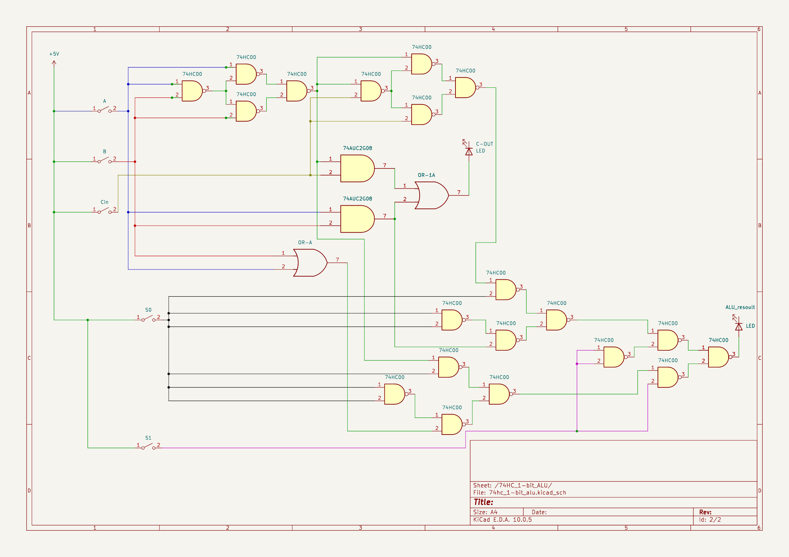

# 1-Bit ALU

A 1-bit Arithmetic Logic Unit designed using 74HC logic chips. It supports ADD, AND, OR and XOR, with two control inputs selecting the result.

## Components

* **74HC00** — NAND gates for XOR operations and multiplexers
* **74HC08** — AND gates
* **74HC32** — OR gates

>[!NOTE]
>    Dedicated XOR gates, such as the **74HC86**, would simplify the circuit and reduce wiring. I did not have any available, so each XOR was built using four NAND gates.

## Operation Selection

| S1 | S0 | Operation | Result               |
| -: | -: | --------- | -------------------- |
|  0 |  0 | AND       | A AND B              |
|  0 |  1 | ADD       | A XOR B XOR Carry-in |
|  1 |  0 | OR        | A OR B               |
|  1 |  1 | XOR       | A XOR B              |

Carry-out comes directly from the full adder and is only relevant when using ADD.

## Truth Table

Results with **Carry-in = 0**:

|  A |  B | AND | ADD result | OR | XOR | Carry-out |
| -: | -: | --: | ---------: | -: | --: | --------: |
|  0 |  0 |   0 |          0 |  0 |   0 |         0 |
|  0 |  1 |   0 |          1 |  1 |   1 |         0 |
|  1 |  0 |   0 |          1 |  1 |   1 |         0 |
|  1 |  1 |   1 |          0 |  1 |   0 |         1 |

Setting Carry-in to 1 flips the ADD result and recalculates Carry-out. The logic operations remain unchanged.

## Schematic

## Test
