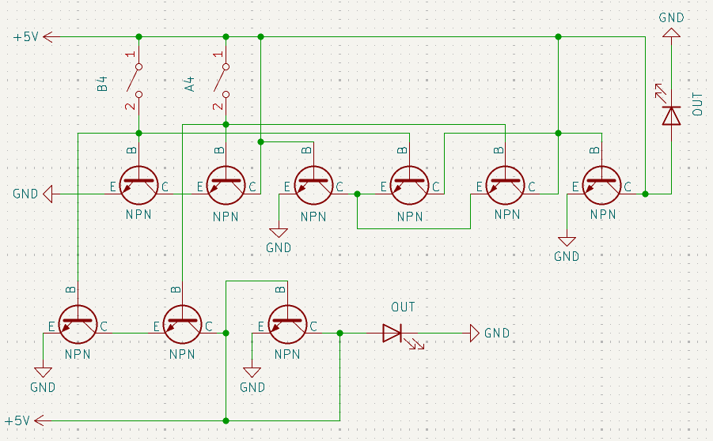
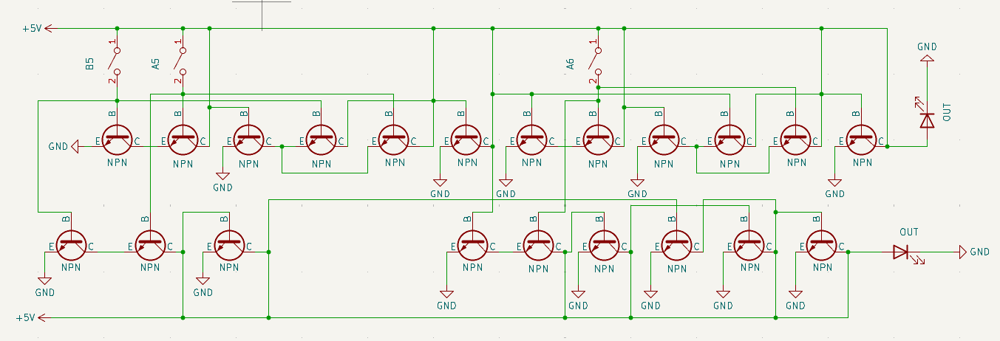

# 1-Bit Adders

Half and full adders built from basic logic gates.

## Half Adder

A half adder adds two binary inputs.

* `Sum = A XOR B`
* `Carry = A AND B`

### Truth Table

|  A |  B | Sum | Carry |
| -: | -: | --: | ----: |
|  0 |  0 |   0 |     0 |
|  0 |  1 |   1 |     0 |
|  1 |  0 |   1 |     0 |
|  1 |  1 |   0 |     1 |

### Schematic

### Test

| Sum 0, Carry 0            | Sum 1, Carry 0                  | Sum 0, Carry 1            |
| ------------------------- | ------------------------------- | ------------------------- |
|  |  |  |

## Full Adder

A full adder adds two binary inputs and a carry input.

* `Sum = A XOR B XOR Carry-in`
* `Carry-out = (A AND B) OR (Carry-in AND (A XOR B))`

### Truth Table

|  A |  B | Carry-in | Sum | Carry-out |
| -: | -: | -------: | --: | --------: |
|  0 |  0 |        0 |   0 |         0 |
|  0 |  0 |        1 |   1 |         0 |
|  0 |  1 |        0 |   1 |         0 |
|  0 |  1 |        1 |   0 |         1 |
|  1 |  0 |        0 |   1 |         0 |
|  1 |  0 |        1 |   0 |         1 |
|  1 |  1 |        0 |   0 |         1 |
|  1 |  1 |        1 |   1 |         1 |

### Schematic

### Test

| Sum 0, Carry 0          | Sum 1, Carry 0          |
| ----------------------- | ----------------------- |
|  |  |

| Sum 0, Carry 1          | Sum 1, Carry 1          |
| ----------------------- | ----------------------- |
|  |  |
