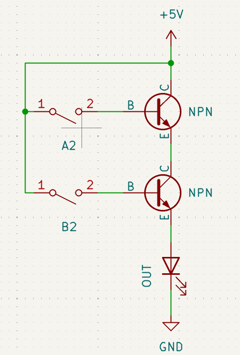

# Transistor AND Gate

A two-input AND gate built with NPN transistors. The LED turns on only when both inputs are HIGH.

## Truth Table

| Input A | Input B | Output | LED |
| ------: | ------: | -----: | --- |
|       0 |       0 |      0 | OFF |
|       0 |       1 |      0 | OFF |
|       1 |       0 |      0 | OFF |
|       1 |       1 |      1 | ON  |

## Schematic

## Test

| No buttons pressed         | One button pressed               | Both buttons pressed       |
| -------------------------- | -------------------------------- | -------------------------- |
|  |  |  |
