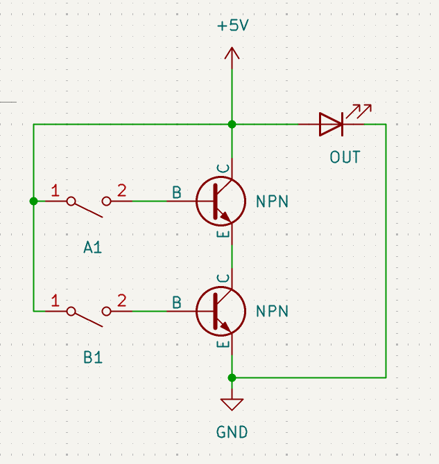
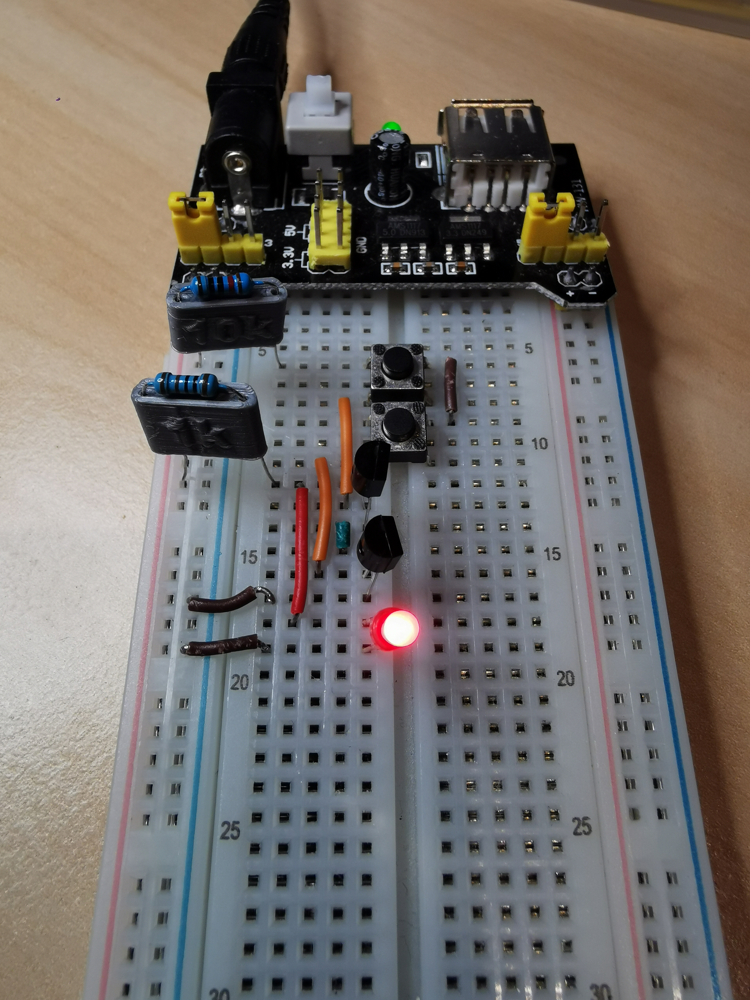
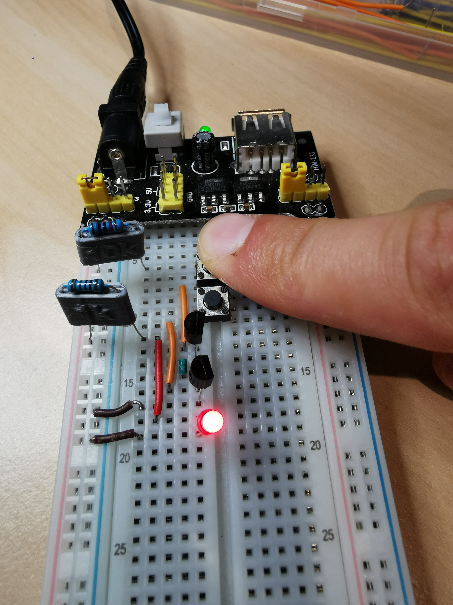
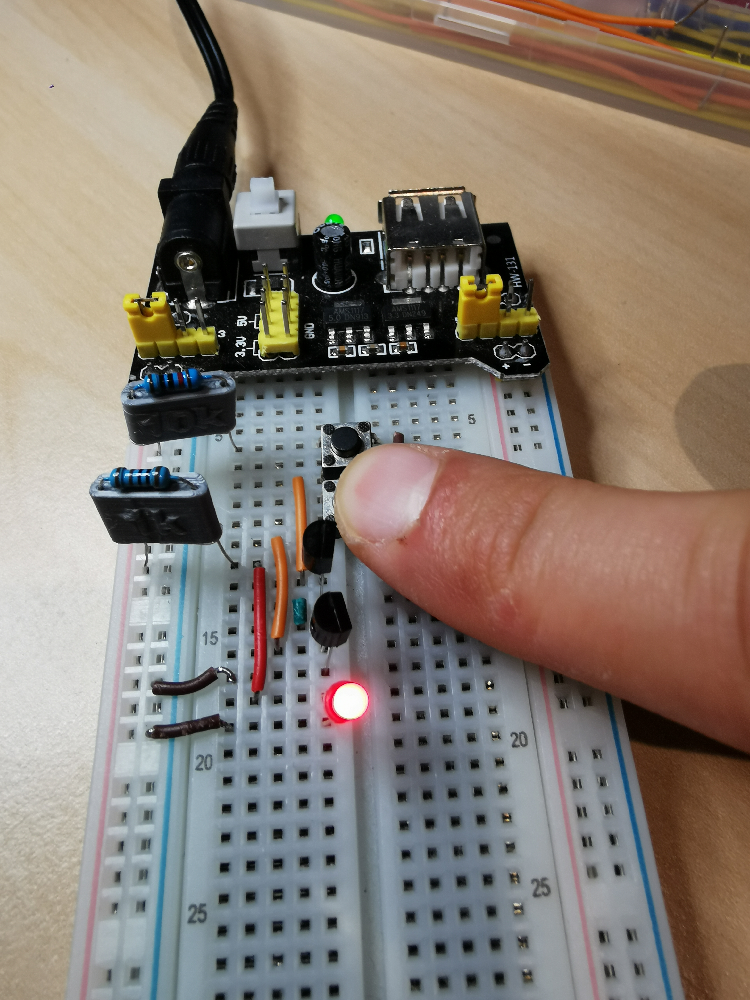
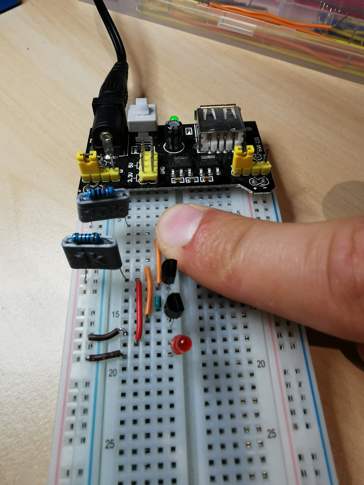

# Transistor NAND Gate

A two-input NAND gate built with NPN transistors. The LED displays the output state.

## Truth Table

| Input A | Input B | Output | LED |
| ------: | ------: | -----: | --- |
|       0 |       0 |      1 | ON  |
|       0 |       1 |      1 | ON  |
|       1 |       0 |      1 | ON  |
|       1 |       1 |      0 | OFF |

## Schematic

## Test

| A = 0, B = 0                           | A = 0, B = 1                           |
| -------------------------------------- | -------------------------------------- |
|  |  |

| A = 1, B = 0                           | A = 1, B = 1                          |
| -------------------------------------- | ------------------------------------- |
|  |  |
