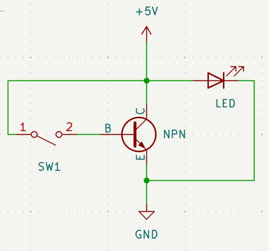
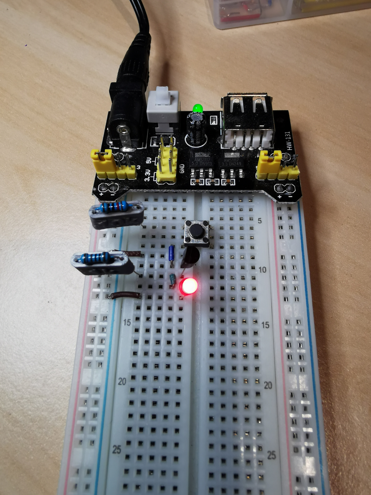
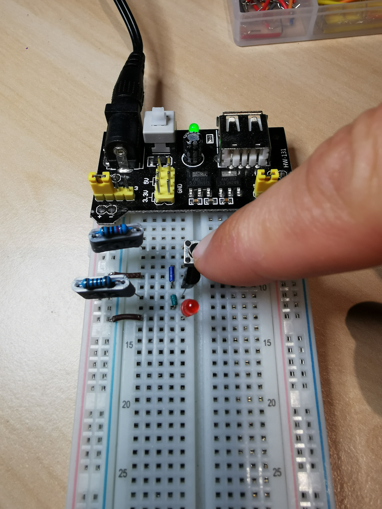

# Transistor NOT Gate

A simple NOT gate built with an NPN transistor. The LED displays the inverted input state.

## Truth Table

| Button / Input | Input | Output | LED |
| -------------- | ----: | -----: | --- |
| Not pressed    |     0 |      1 | ON  |
| Pressed        |     1 |      0 | OFF |

## Schematic

## Test

| Button not pressed                | Button pressed                 |
| --------------------------------- | ------------------------------ |
|  |  |

