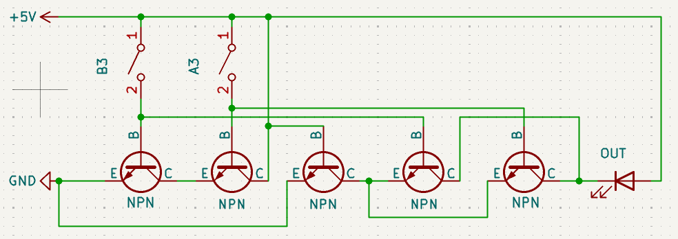

# Transistor XOR Gate

A two-input XOR gate designed with discrete transistors. The output is HIGH when the inputs are different.

## Truth Table

| Input A | Input B | Output |
| ------: | ------: | -----: |
|       0 |       0 |      0 |
|       0 |       1 |      1 |
|       1 |       0 |      1 |
|       1 |       1 |      0 |

## Schematic

